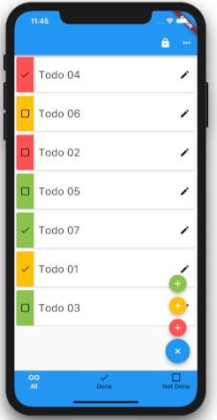

## Example Use Cases  
### TODO App - User Rewards  
Starting with a simple TODO application...  
  

we want to enable the user to ask a DAO for compensation.

TODO: images showing new UX additions from the example app  

